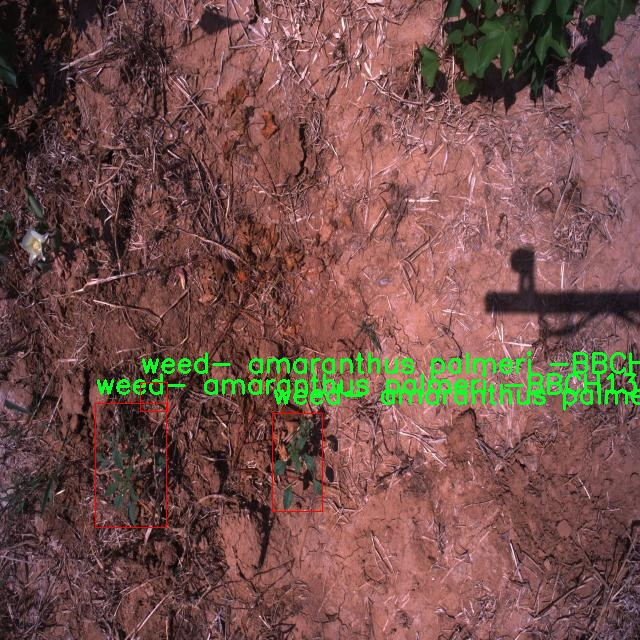

### 1.背景意义

研究背景与意义

随着全球农业生产的不断发展，杂草的管理与控制成为了提升作物产量和质量的重要环节。杂草不仅会与作物争夺水分、养分和光照，还可能成为病虫害的滋生地，从而对农业生产造成严重影响。因此，准确、快速地检测和分类杂草，尤其是在大规模农业生产中，显得尤为重要。传统的人工识别方法效率低下且容易受到主观因素的影响，无法满足现代农业对高效、精准管理的需求。

近年来，深度学习技术的迅猛发展为农业领域的图像识别提供了新的解决方案。YOLO（You Only Look Once）系列算法因其实时性和高准确率，成为目标检测领域的热门选择。尤其是YOLOv11的推出，进一步提升了检测精度和速度，使其在复杂环境下的应用成为可能。基于此，构建一个基于改进YOLOv11的航拍杂草检测与分类系统，能够有效提升杂草识别的效率和准确性。

本研究所使用的数据集包含了8种不同生长阶段的“Amaranthus palmeri”杂草样本，涵盖了从BBCH10到BBCH69的多个生长阶段。这一细致的分类为模型的训练提供了丰富的样本，能够帮助系统在实际应用中更好地适应不同的环境和条件。此外，数据集经过精心的预处理和增强，确保了模型在训练过程中的多样性和鲁棒性。

通过该系统的研发与应用，不仅能够提高杂草检测的效率，还将为农业管理提供科学依据，助力实现精准农业的目标。这一研究不仅具有重要的理论意义，也将为实际农业生产提供切实可行的技术支持，推动农业现代化进程。

### 2.视频效果

[2.1 视频效果](https://www.bilibili.com/video/BV1jBBeY8Enp/)

### 3.图片效果


##### [项目涉及的源码数据来源链接](https://kdocs.cn/l/cszuIiCKVNis)**

注意：本项目提供训练的数据集和训练教程,由于版本持续更新,暂不提供权重文件（best.pt）,请按照6.训练教程进行训练后实现上图演示的效果。

### 4.数据集信息

##### 4.1 本项目数据集类别数＆类别名

nc: 8
names: ['weed- amaranthus palmeri -BBCH10-12-', 'weed- amaranthus palmeri -BBCH13-16-', 'weed- amaranthus palmeri -BBCH13-29 - bushy-', 'weed- amaranthus palmeri -BBCH17-19-', 'weed- amaranthus palmeri -BBCH51-59 - bushy-', 'weed- amaranthus palmeri -BBCH51-59-', 'weed- amaranthus palmeri -BBCH60-69 - bushy-', 'weed- amaranthus palmeri -BBCH60-69-']


该项目为【目标检测】数据集，请在【训练教程和Web端加载模型教程（第三步）】这一步的时候按照【目标检测】部分的教程来训练

##### 4.2 本项目数据集信息介绍

本项目数据集信息介绍

本项目所使用的数据集名为“SCHWARZ_WEED1”，其主要目标是为改进YOLOv11的航拍杂草检测与分类系统提供支持。该数据集专注于特定种类的杂草，尤其是不同生长阶段的“Amaranthus palmeri”，即美洲蓼。数据集中包含8个类别，涵盖了该植物在不同生长阶段的多样性，具体类别包括：BBCH10-12、BBCH13-16、BBCH13-29（灌木状）、BBCH17-19、BBCH51-59（灌木状）、BBCH51-59、BBCH60-69（灌木状）以及BBCH60-69。这些类别的细分使得模型能够更精确地识别和分类不同生长阶段的美洲蓼，从而提高杂草管理的效率。

数据集的构建过程涉及大量的航拍图像采集，确保在不同的环境条件和光照条件下均能获取高质量的样本。这些图像经过精心标注，确保每个类别的特征都能被准确捕捉和学习。通过使用该数据集，YOLOv11模型能够在训练过程中学习到不同生长阶段的视觉特征，从而在实际应用中实现更高的检测精度和分类准确性。

此外，数据集的多样性和丰富性为模型的泛化能力提供了良好的基础，使其在面对真实世界中的杂草检测任务时，能够有效应对不同的场景和变化。通过本项目的数据集，我们期望能够推动农业领域的智能化发展，帮助农民更好地管理杂草，减少化学除草剂的使用，从而实现可持续农业的目标。




### 5.全套项目环境部署视频教程（零基础手把手教学）

[5.1 所需软件PyCharm和Anaconda安装教程（第一步）](https://www.bilibili.com/video/BV1BoC1YCEKi/?spm_id_from=333.999.0.0&vd_source=bc9aec86d164b67a7004b996143742dc)


[5.2 安装Python虚拟环境创建和依赖库安装视频教程（第二步）](https://www.bilibili.com/video/BV1ZoC1YCEBw?spm_id_from=333.788.videopod.sections&vd_source=bc9aec86d164b67a7004b996143742dc)

### 6.改进YOLOv11训练教程和Web_UI前端加载模型教程（零基础手把手教学）

[6.1 改进YOLOv11训练教程和Web_UI前端加载模型教程（第三步）](https://www.bilibili.com/video/BV1BoC1YCEhR?spm_id_from=333.788.videopod.sections&vd_source=bc9aec86d164b67a7004b996143742dc)


按照上面的训练视频教程链接加载项目提供的数据集，运行train.py即可开始训练



     Epoch   gpu_mem       box       obj       cls    labels  img_size
     1/200     20.8G   0.01576   0.01955  0.007536        22      1280: 100%|██████████| 849/849 [14:42<00:00,  1.04s/it]
               Class     Images     Labels          P          R     mAP@.5 mAP@.5:.95: 100%|██████████| 213/213 [01:14<00:00,  2.87it/s]
                 all       3395      17314      0.994      0.957      0.0957      0.0843

     Epoch   gpu_mem       box       obj       cls    labels  img_size
     2/200     20.8G   0.01578   0.01923  0.007006        22      1280: 100%|██████████| 849/849 [14:44<00:00,  1.04s/it]
               Class     Images     Labels          P          R     mAP@.5 mAP@.5:.95: 100%|██████████| 213/213 [01:12<00:00,  2.95it/s]
                 all       3395      17314      0.996      0.956      0.0957      0.0845

     Epoch   gpu_mem       box       obj       cls    labels  img_size
     3/200     20.8G   0.01561    0.0191  0.006895        27      1280: 100%|██████████| 849/849 [10:56<00:00,  1.29it/s]
               Class     Images     Labels          P          R     mAP@.5 mAP@.5:.95: 100%|███████   | 187/213 [00:52<00:00,  4.04it/s]
                 all       3395      17314      0.996      0.957      0.0957      0.0845


###### [项目数据集下载链接](https://kdocs.cn/l/cszuIiCKVNis)

### 7.原始YOLOv11算法讲解


其实到了YOLOV11 基本创新点就不太多了，主要就是大家互相排列组合复用不同的网络模块、损失函数和样本匹配策略，需要注意YOLO V5、V8 V11
都是1个公司的，其余的个人建议看看V8的，剩下的了解就好。

V11支持多种视觉任务：物体检测、实例分割、图像分类、姿态估计和定向物体检测（OBB）。

##### YOLOv11
基本和YOLOV8同源，甚至git目前都是1个，部分代码注释还是YOLOV8的，所以建议先看我写的YOLOV8相关博客，对比YOLOV8主要涉及到：

*backbone 中的使用C2f模块 变为 c3k2 模块。

*backbone 中的最后一层（sppf层）后增加了C2PSA模块。

*head 解耦头中的分类检测头两个Conv 变为 DWConv。

整体技术而言：

*backbone 使用了C2K2模块+最后SPPF模块级联C2PSA模块；

*neck 使用PAN结构，并且里面也使用C3K2模块；

*head使用了anchor-free + Decoupled-head，其中回归头使用正常的卷积，分类头使用DWConv；

*损失函数使用了分类BCE、回归CIOU + VFL的组合；

*框匹配策略由静态匹配改为了Task-Aligned Assigner匹配方式；

*训练策略没有提及，其中YOLOV8可以参考如下最后 10 个 epoch 关闭 Mosaic 的操作、训练总 epoch 数从 300 提升到了 500。

##### 主要思路


配置文件：[ultralytics/ultralytics/cfg/models/11/yolo11.yaml at main ·
ultralytics/ultralytics ·
GitHub](https://github.com/ultralytics/ultralytics/blob/main/ultralytics/cfg/models/11/yolo11.yaml
"ultralytics/ultralytics/cfg/models/11/yolo11.yaml at main ·
ultralytics/ultralytics · GitHub")

解析函数：[ultralytics/ultralytics/nn/tasks.py at main · ultralytics/ultralytics ·
GitHub](https://github.com/ultralytics/ultralytics/blob/main/ultralytics/nn/tasks.py#L934
"ultralytics/ultralytics/nn/tasks.py at main · ultralytics/ultralytics ·
GitHub")


##### 具体细节

##### input

输入要求以及预处理，可选项比较多，可以参考这个配置文件：[ultralytics/ultralytics/cfg/default.yaml at main
· ultralytics/ultralytics ·
GitHub](https://github.com/ultralytics/ultralytics/blob/main/ultralytics/cfg/default.yaml
"ultralytics/ultralytics/cfg/default.yaml at main · ultralytics/ultralytics ·
GitHub") 的Hyperparameters 部分。

基础输入仍然为640*640。预处理就是熟悉的letterbox（根据参数配置可以为不同的缩放填充模式，主要用于resize到640）+
转换rgb、chw、int8(0-255)->float（0-1），注意没有归一化操作。需要注意的是作者实现的mosaic和网上看到的不同，对比如下图（左边网上版本，右边是YOLO的实现）。并且作者添加了在最后10轮关闭mosaic增强（YOLOV8开始支持，具体原因个人的经验如我的这篇文章：yolov5
mosaic相关，关闭参数在 Train settings 部分的close_mosaic 选项）


##### backbone

主干网络以及改进

这里不去特意强调对比YOLOv5、V8等等的改进，因为各个系列都在疯狂演进，个人认为没必要花费时间看差异，着重看看一些比较重要的模块即可。源代码：

大多数模块：[ultralytics/ultralytics/nn/modules/block.py at main ·
ultralytics/ultralytics ·
GitHub](https://github.com/ultralytics/ultralytics/blob/main/ultralytics/nn/modules/block.py
"ultralytics/ultralytics/nn/modules/block.py at main · ultralytics/ultralytics
· GitHub")

head 部分：[ultralytics/ultralytics/nn/modules/head.py at main ·
ultralytics/ultralytics ·
GitHub](https://github.com/ultralytics/ultralytics/blob/main/ultralytics/nn/modules/head.py
"ultralytics/ultralytics/nn/modules/head.py at main · ultralytics/ultralytics
· GitHub")

串联模块构造网络：[ultralytics/ultralytics/nn/tasks.py at main ·
ultralytics/ultralytics ·
GitHub](https://github.com/ultralytics/ultralytics/blob/main/ultralytics/nn/tasks.py
"ultralytics/ultralytics/nn/tasks.py at main · ultralytics/ultralytics ·
GitHub")

##### 1）CBS 模块（后面叫做Conv）

就是pytorch 自带的conv + BN +SiLU，这里对应上面的配置文件的Conv 的 args 比如[64, 3, 2] 就是 conv2d
的c2=64、k=3、 s =2、c1 自动为上一层参数、p 为自动计算，真实需要计算scales 里面的with 和 max_channels 缩放系数。

这里连续使用两个3*3卷积stride为2的CBS模块直接横竖各降低了4倍分辨率（整体变为原来1/16）。这个还是比较猛的，敢在如此小的感受野下连续两次仅仅用一层卷积就下采样,当然作为代价它的特征图还是比较厚的分别为16、32。


    
    
        class Conv(nn.Module):
        """Standard convolution with args(ch_in, ch_out, kernel, stride, padding, groups, dilation, activation)."""
    
        default_act = nn.SiLU()  # default activation
    
        def __init__(self, c1, c2, k=1, s=1, p=None, g=1, d=1, act=True):
            """Initialize Conv layer with given arguments including activation."""
            super().__init__()
            self.conv = nn.Conv2d(c1, c2, k, s, autopad(k, p, d), groups=g, dilation=d, bias=False)
            self.bn = nn.BatchNorm2d(c2)
            self.act = self.default_act if act is True else act if isinstance(act, nn.Module) else nn.Identity()
    
        def forward(self, x):
            """Apply convolution, batch normalization and activation to input tensor."""
            return self.act(self.bn(self.conv(x)))
    
        def forward_fuse(self, x):
            """Perform transposed convolution of 2D data."""
            return self.act(self.conv(x))

##### 2）c3k2 模块

##### Bottleneck

有两种结构，需要参数shortcut和两个conv的宽度是否相同来控制。

##### C3 & C3K

都是CSP bottleneck module with 3 convolutions, C3 代表3个卷积层，
K代表其中bottleneck中的卷积核为支持自定义，其实这里c3k作者使用的默认的3*3卷积核也就等同于使用c3(c3是3*3卷积核)。

##### c2f & c3k2

其实也就是仿照YOLOv7 的ELAN
结构，通过更多的分支夸层链接，丰富了模型的梯度流。C3K2模块其实就是C2F模块转变出来的，它代码中有一个设置，就是当c3k这个参数为FALSE的时候，C3K2模块就是C2F模块，也就是说它的Bottleneck是普通的Bottleneck；反之当它为true的时候，将Bottleneck模块替换成C3K模块。模块中存在
Split 等操作对特定硬件部署没有之前那么友好了。需要针对自己的硬件进行测试看对最终推理速度的影响。

可视化关系如下，这里需要注意配置文件中的参数，比如21行[-1, 2, C3k2, [512, False, 0.25]]
512代表宽度、false代表是否使用shortcut、0.25代表c2f的宽度缩放。也就是第一个Conv的输出宽度。


源代码如下:

    
    
    class Bottleneck(nn.Module):
        """Standard bottleneck."""
    
        def __init__(self, c1, c2, shortcut=True, g=1, k=(3, 3), e=0.5):
            """Initializes a standard bottleneck module with optional shortcut connection and configurable parameters."""
            super().__init__()
            c_ = int(c2 * e)  # hidden channels
            self.cv1 = Conv(c1, c_, k[0], 1)
            self.cv2 = Conv(c_, c2, k[1], 1, g=g)
            self.add = shortcut and c1 == c2
    
        def forward(self, x):
            """Applies the YOLO FPN to input data."""
            return x + self.cv2(self.cv1(x)) if self.add else self.cv2(self.cv1(x))
    
    class C3(nn.Module):
        """CSP Bottleneck with 3 convolutions."""
    
        def __init__(self, c1, c2, n=1, shortcut=True, g=1, e=0.5):
            """Initialize the CSP Bottleneck with given channels, number, shortcut, groups, and expansion values."""
            super().__init__()
            c_ = int(c2 * e)  # hidden channels
            self.cv1 = Conv(c1, c_, 1, 1)
            self.cv2 = Conv(c1, c_, 1, 1)
            self.cv3 = Conv(2 * c_, c2, 1)  # optional act=FReLU(c2)
            self.m = nn.Sequential(*(Bottleneck(c_, c_, shortcut, g, k=((1, 1), (3, 3)), e=1.0) for _ in range(n)))
    
        def forward(self, x):
            """Forward pass through the CSP bottleneck with 2 convolutions."""
            return self.cv3(torch.cat((self.m(self.cv1(x)), self.cv2(x)), 1))
    
    class C3k(C3):
        """C3k is a CSP bottleneck module with customizable kernel sizes for feature extraction in neural networks."""
    
        def __init__(self, c1, c2, n=1, shortcut=True, g=1, e=0.5, k=3):
            """Initializes the C3k module with specified channels, number of layers, and configurations."""
            super().__init__(c1, c2, n, shortcut, g, e)
            c_ = int(c2 * e)  # hidden channels
            # self.m = nn.Sequential(*(RepBottleneck(c_, c_, shortcut, g, k=(k, k), e=1.0) for _ in range(n)))
            self.m = nn.Sequential(*(Bottleneck(c_, c_, shortcut, g, k=(k, k), e=1.0) for _ in range(n)))
    
    class C2f(nn.Module):
        """Faster Implementation of CSP Bottleneck with 2 convolutions."""
    
        def __init__(self, c1, c2, n=1, shortcut=False, g=1, e=0.5):
            """Initializes a CSP bottleneck with 2 convolutions and n Bottleneck blocks for faster processing."""
            super().__init__()
            self.c = int(c2 * e)  # hidden channels
            self.cv1 = Conv(c1, 2 * self.c, 1, 1)
            self.cv2 = Conv((2 + n) * self.c, c2, 1)  # optional act=FReLU(c2)
            self.m = nn.ModuleList(Bottleneck(self.c, self.c, shortcut, g, k=((3, 3), (3, 3)), e=1.0) for _ in range(n))
    
        def forward(self, x):
            """Forward pass through C2f layer."""
            y = list(self.cv1(x).chunk(2, 1))
            y.extend(m(y[-1]) for m in self.m)
            return self.cv2(torch.cat(y, 1))
    
        def forward_split(self, x):
            """Forward pass using split() instead of chunk()."""
            y = list(self.cv1(x).split((self.c, self.c), 1))
            y.extend(m(y[-1]) for m in self.m)
            return self.cv2(torch.cat(y, 1))
    
    class C3k2(C2f):
        """Faster Implementation of CSP Bottleneck with 2 convolutions."""
    
        def __init__(self, c1, c2, n=1, c3k=False, e=0.5, g=1, shortcut=True):
            """Initializes the C3k2 module, a faster CSP Bottleneck with 2 convolutions and optional C3k blocks."""
            super().__init__(c1, c2, n, shortcut, g, e)
            self.m = nn.ModuleList(
                C3k(self.c, self.c, 2, shortcut, g) if c3k else Bottleneck(self.c, self.c, shortcut, g) for _ in range(n)
            )

##### 3）sppf 模块

对比spp，将简单的并行max pooling 改为串行+并行的方式。对比如下（左边是SPP，右边是SPPF）：


    
    
        class SPPF(nn.Module):
        # Spatial Pyramid Pooling - Fast (SPPF) layer for YOLOv5 by Glenn Jocher
        def __init__(self, c1, c2, k=5):  # equivalent to SPP(k=(5, 9, 13))
            super().__init__()
            c_ = c1 // 2  # hidden channels
            self.cv1 = Conv(c1, c_, 1, 1)
            self.cv2 = Conv(c_ * 4, c2, 1, 1)
            self.m = nn.MaxPool2d(kernel_size=k, stride=1, padding=k // 2)
    
        def forward(self, x):
            x = self.cv1(x)
            with warnings.catch_warnings():
                warnings.simplefilter('ignore')  # suppress torch 1.9.0 max_pool2d() warning
                y1 = self.m(x)
                y2 = self.m(y1)
                return self.cv2(torch.cat((x, y1, y2, self.m(y2)), 1))

##### 4）C2PSA 模块

C2PSA它结合了PSA(Pointwise Spatial
Attention)块，用于增强特征提取和注意力机制。下面的图建议从左到右看，这样才能更有条理的理解，其实PSA个人感觉就是仿着VIT
的Attention来做的，是把输入C2PSA的特征图的h*w 看做VIT 的path数（也可以理解为NLP中token 个数），特征图的channel
数看做VIT特征维度（CNN的宽度，或者理解为NLP中token
编码后的特征维度），然后计算出QKV（这里需要注意第四幅图的QKV是值，不是操作，所以标注成了圆角矩形，这里是为了大家好理解），这里的Attention其实是在h*w维度计算空间Attention，个人感觉是强制给了全局感受野，并且并联了一个3*3的深度可分离卷积的单空间部分，就是仅在每一个特征图上进行3*3卷积，具体实现是通过pytorch
conv2d 的
group参数设置为特征图的通道数。特别的关于Conv的参数分别为：输入通道数、输出通道数、卷积核尺寸、pad尺寸、group数、是否有激活函数（默认silu）。图中的最后一幅省略了一些细节，可以参考源码。

注意区别C2fPSA，C2fPSA才是对 C2f 模块的扩展，通过在标准 C2f 模块中引入 PSA
块，C2fPSA实现了更强大的注意力机制，从而提高了模型对重要特征的捕捉能力。作者实现了该模块但最终没有使用。


涉及的源码：

    
    
    class Attention(nn.Module):
        """
        Attention module that performs self-attention on the input tensor.
    
        Args:
            dim (int): The input tensor dimension.
            num_heads (int): The number of attention heads.
            attn_ratio (float): The ratio of the attention key dimension to the head dimension.
    
        Attributes:
            num_heads (int): The number of attention heads.
            head_dim (int): The dimension of each attention head.
            key_dim (int): The dimension of the attention key.
            scale (float): The scaling factor for the attention scores.
            qkv (Conv): Convolutional layer for computing the query, key, and value.
            proj (Conv): Convolutional layer for projecting the attended values.
            pe (Conv): Convolutional layer for positional encoding.
        """
    
        def __init__(self, dim, num_heads=8, attn_ratio=0.5):
            """Initializes multi-head attention module with query, key, and value convolutions and positional encoding."""
            super().__init__()
            self.num_heads = num_heads
            self.head_dim = dim // num_heads
            self.key_dim = int(self.head_dim * attn_ratio)
            self.scale = self.key_dim**-0.5
            nh_kd = self.key_dim * num_heads
            h = dim + nh_kd * 2
            self.qkv = Conv(dim, h, 1, act=False)
            self.proj = Conv(dim, dim, 1, act=False)
            self.pe = Conv(dim, dim, 3, 1, g=dim, act=False)
    
        def forward(self, x):
            """
            Forward pass of the Attention module.
    
            Args:
                x (torch.Tensor): The input tensor.
    
            Returns:
                (torch.Tensor): The output tensor after self-attention.
            """
            B, C, H, W = x.shape
            N = H * W
            qkv = self.qkv(x)
            q, k, v = qkv.view(B, self.num_heads, self.key_dim * 2 + self.head_dim, N).split(
                [self.key_dim, self.key_dim, self.head_dim], dim=2
            )
    
            attn = (q.transpose(-2, -1) @ k) * self.scale
            attn = attn.softmax(dim=-1)
            x = (v @ attn.transpose(-2, -1)).view(B, C, H, W) + self.pe(v.reshape(B, C, H, W))
            x = self.proj(x)
            return x
    
    class PSABlock(nn.Module):
        """
        PSABlock class implementing a Position-Sensitive Attention block for neural networks.
    
        This class encapsulates the functionality for applying multi-head attention and feed-forward neural network layers
        with optional shortcut connections.
    
        Attributes:
            attn (Attention): Multi-head attention module.
            ffn (nn.Sequential): Feed-forward neural network module.
            add (bool): Flag indicating whether to add shortcut connections.
    
        Methods:
            forward: Performs a forward pass through the PSABlock, applying attention and feed-forward layers.
    
        Examples:
            Create a PSABlock and perform a forward pass
            >>> psablock = PSABlock(c=128, attn_ratio=0.5, num_heads=4, shortcut=True)
            >>> input_tensor = torch.randn(1, 128, 32, 32)
            >>> output_tensor = psablock(input_tensor)
        """
    
        def __init__(self, c, attn_ratio=0.5, num_heads=4, shortcut=True) -> None:
            """Initializes the PSABlock with attention and feed-forward layers for enhanced feature extraction."""
            super().__init__()
    
            self.attn = Attention(c, attn_ratio=attn_ratio, num_heads=num_heads)
            self.ffn = nn.Sequential(Conv(c, c * 2, 1), Conv(c * 2, c, 1, act=False))
            self.add = shortcut
    
        def forward(self, x):
            """Executes a forward pass through PSABlock, applying attention and feed-forward layers to the input tensor."""
            x = x + self.attn(x) if self.add else self.attn(x)
            x = x + self.ffn(x) if self.add else self.ffn(x)
            return x
        
    class C2PSA(nn.Module):
        """
        C2PSA module with attention mechanism for enhanced feature extraction and processing.
    
        This module implements a convolutional block with attention mechanisms to enhance feature extraction and processing
        capabilities. It includes a series of PSABlock modules for self-attention and feed-forward operations.
    
        Attributes:
            c (int): Number of hidden channels.
            cv1 (Conv): 1x1 convolution layer to reduce the number of input channels to 2*c.
            cv2 (Conv): 1x1 convolution layer to reduce the number of output channels to c.
            m (nn.Sequential): Sequential container of PSABlock modules for attention and feed-forward operations.
    
        Methods:
            forward: Performs a forward pass through the C2PSA module, applying attention and feed-forward operations.
    
        Notes:
            This module essentially is the same as PSA module, but refactored to allow stacking more PSABlock modules.
    
        Examples:
            >>> c2psa = C2PSA(c1=256, c2=256, n=3, e=0.5)
            >>> input_tensor = torch.randn(1, 256, 64, 64)
            >>> output_tensor = c2psa(input_tensor)
        """
    
        def __init__(self, c1, c2, n=1, e=0.5):
            """Initializes the C2PSA module with specified input/output channels, number of layers, and expansion ratio."""
            super().__init__()
            assert c1 == c2
            self.c = int(c1 * e)
            self.cv1 = Conv(c1, 2 * self.c, 1, 1)
            self.cv2 = Conv(2 * self.c, c1, 1)
    
            self.m = nn.Sequential(*(PSABlock(self.c, attn_ratio=0.5, num_heads=self.c // 64) for _ in range(n)))
    
        def forward(self, x):
            """Processes the input tensor 'x' through a series of PSA blocks and returns the transformed tensor."""
            a, b = self.cv1(x).split((self.c, self.c), dim=1)
            b = self.m(b)
            return self.cv2(torch.cat((a, b), 1))

##### 3、neck & head

##### 1）检测头

YOLOV11 Head 部分和YOLOV8是近似的，所以简单对比YOLOV5、V8、V11。


如上面图，上边是YOLOV5 的结构，中是YOLOv8 的结构，下面是YOLOV11 结构

Yolov5: 检测和分类共用一个卷积（coupled head）并且是anchor based ,其 卷积输出为（5+N class）*3，其中
5为bbox 四个值（具体代表什么不同版本略有不同，官方git有说明，历史版本见 目标检测算法——YOLOV5 ）+ 一个obj 值
（是否有目标，这个是从YOLO V1 传承下来的，个人感觉有点绕和不合理，并且后面取消），N class 为类别数，3为anchor 的数量，默认是3个。

YOLOv8：检测和分类的卷积是解耦的（decoupled），如中图，上面一条卷积支路是回归框，框的特征图channel为4*regmax，关于这个regmax
后面我们详细的解释,并不是anchor；分类的channel 为类别数。

YOLOV11：检测和分类的卷积是解耦的（decoupled），如右图，上面一条卷积支路是回归框，框的特征图channel为4*regmax，关于这个regmax
后面我们详细的解释,并不是anchor；分类的channel 为类别数，分类使用深度可分离卷积替代常规卷积降低计算量。

源码部分如下

    
    
    class Detect(nn.Module):
        """YOLO Detect head for detection models."""
    
        dynamic = False  # force grid reconstruction
        export = False  # export mode
        end2end = False  # end2end
        max_det = 300  # max_det
        shape = None
        anchors = torch.empty(0)  # init
        strides = torch.empty(0)  # init
    
        def __init__(self, nc=80, ch=()):
            """Initializes the YOLO detection layer with specified number of classes and channels."""
            super().__init__()
            self.nc = nc  # number of classes
            self.nl = len(ch)  # number of detection layers
            self.reg_max = 16  # DFL channels (ch[0] // 16 to scale 4/8/12/16/20 for n/s/m/l/x)
            self.no = nc + self.reg_max * 4  # number of outputs per anchor
            self.stride = torch.zeros(self.nl)  # strides computed during build
            c2, c3 = max((16, ch[0] // 4, self.reg_max * 4)), max(ch[0], min(self.nc, 100))  # channels
            self.cv2 = nn.ModuleList(
                nn.Sequential(Conv(x, c2, 3), Conv(c2, c2, 3), nn.Conv2d(c2, 4 * self.reg_max, 1)) for x in ch
            )
            self.cv3 = nn.ModuleList(
                nn.Sequential(
                    nn.Sequential(DWConv(x, x, 3), Conv(x, c3, 1)),
                    nn.Sequential(DWConv(c3, c3, 3), Conv(c3, c3, 1)),
                    nn.Conv2d(c3, self.nc, 1),
                )
                for x in ch
            )
            self.dfl = DFL(self.reg_max) if self.reg_max > 1 else nn.Identity()
    
            if self.end2end:
                self.one2one_cv2 = copy.deepcopy(self.cv2)
                self.one2one_cv3 = copy.deepcopy(self.cv3)
    
        def forward(self, x):
            """Concatenates and returns predicted bounding boxes and class probabilities."""
            if self.end2end:
                return self.forward_end2end(x)
    
            for i in range(self.nl):
                x[i] = torch.cat((self.cv2[i](x[i]), self.cv3[i](x[i])), 1)
            if self.training:  # Training path
                return x
            y = self._inference(x)
            return y if self.export else (y, x)

因此主要的变化可以认为有三个：（1）coupled head -> decoupled head ；（2）obj 分支消失；（3）anchor
based——> anchor free ; 4) 深度可分离卷积。

（1）coupled head -> decoupled head

这个解耦操作，看YOLO x 的论文，约有1% 的提升。逻辑和实现都比较直观易懂，不再赘述。

（2）obj 分支消失；

这个其实我自己再看YOLO V1 的时候就有疑问，它存在的意义。后来人们发现，其实obj
的在训练和推理过程中存在逻辑不一致性。具体而言（摘自“<https://zhuanlan.zhihu.com/p/147691786>”）

A。用法不一致。训练的时候，分类和质量估计各自训练自个儿的，但测试的时候却又是乘在一起作为NMS score排序的依据，这个操作显然没有end-to-
end，必然存在一定的gap。（个人认为还好，就是两个监督信号）

B。对象不一致。借助Focal
Loss的力量，分类分支能够使得少量的正样本和大量的负样本一起成功训练，但是质量估计通常就只针对正样本训练。那么，对于one-
stage的检测器而言，在做NMS
score排序的时候，所有的样本都会将分类score和质量预测score相乘用于排序，那么必然会存在一部分分数较低的“负样本”的质量预测是没有在训练过程中有监督信号的，对于大量可能的负样本，他们的质量预测是一个未定义行为。这就很有可能引发这么一个情况：一个分类score相对低的真正的负样本，由于预测了一个不可信的极高的质量score，而导致它可能排到一个真正的正样本（分类score不够高且质量score相对低）的前面。问题一如图所示：


（3）anchor based——> anchor free

这里主要涉及怎么定义回归内容以及如何匹配GT框的问题。也就是如下：

##### 2）匹配策略

A。回归的内容当前版本就是回归的lftp四个值（这四个值是距离匹配到的anchor 点的距离值！不是图片的绝对位置）。后面推理阶段通过
dist2bbox函数转换为需要的格式：

[
https://github.com/ultralytics/ultralytics/blob/cc3c774bde86ffce694d202b7383da6cc1721c1b/ultralytics/nn/modules.py#L378](https://github.com/ultralytics/ultralytics/blob/cc3c774bde86ffce694d202b7383da6cc1721c1b/ultralytics/nn/modules.py#L378
"  
 https://github.com/ultralytics/ultralytics/blob/cc3c774bde86ffce694d202b7383da6cc1721c1b/ultralytics/nn/modules.py#L378")

[
https://github.com/ultralytics/ultralytics/blob/cc3c774bde86ffce694d202b7383da6cc1721c1b/ultralytics/yolo/utils/tal.py#L196](https://github.com/ultralytics/ultralytics/blob/cc3c774bde86ffce694d202b7383da6cc1721c1b/ultralytics/yolo/utils/tal.py#L196
"  
 https://github.com/ultralytics/ultralytics/blob/cc3c774bde86ffce694d202b7383da6cc1721c1b/ultralytics/yolo/utils/tal.py#L196")。

    
    
       def dist2bbox(distance, anchor_points, xywh=True, dim=-1):
        """Transform distance(ltrb) to box(xywh or xyxy)."""
        lt, rb = torch.split(distance, 2, dim)
        x1y1 = anchor_points - lt
        x2y2 = anchor_points + rb
        if xywh:
            c_xy = (x1y1 + x2y2) / 2
            wh = x2y2 - x1y1
            return torch.cat((c_xy, wh), dim)  # xywh bbox
        return torch.cat((x1y1, x2y2), dim)  # xyxy bbox

##### B.匹配策略

YOLOv5 采用静态的匹配策略，V8采用了动态的TaskAlignedAssigner，其余常见的动态匹配还有： YOLOX 的 simOTA、TOOD
的 TaskAlignedAssigner 和 RTMDet 的 DynamicSoftLabelAssigner。


TaskAligned使用分类得分和IoU的高阶组合来衡量Task-Alignment的程度。使用上面公式来对每个实例计算Anchor-level
的对齐程度：s 和 u 分别为分类得分和 IoU 值，α 和 β 为权重超参。t 可以同时控制分类得分和IoU 的优化来实现 Task-
Alignment，可以引导网络动态的关注于高质量的Anchor。采用一种简单的分配规则选择训练样本：对每个实例，选择m个具有最大t值的Anchor作为正样本，选择其余的Anchor作为负样本。然后，通过损失函数(针对分类与定位的对齐而设计的损失函数)进行训练。

代码地址：[ultralytics/ultralytics/yolo/utils/tal.py at
c0c0c138c12699807ff9446f942cb3bd325d670b · ultralytics/ultralytics ·
GitHub](https://github.com/ultralytics/ultralytics/blob/c0c0c138c12699807ff9446f942cb3bd325d670b/ultralytics/yolo/utils/tal.py#L56
"ultralytics/ultralytics/yolo/utils/tal.py at
c0c0c138c12699807ff9446f942cb3bd325d670b · ultralytics/ultralytics · GitHub")

默认参数如下（当前版本这些超参没有提供修改的接口，如需修改需要在源码上进行修改）：


##### 4、loss function

损失函数设计

Loss 计算包括 2 个分支： 分类和回归分支，没有了之前的 objectness 分支。

分类分支依然采用 BCE Loss。回归分支使用了 Distribution Focal Loss（DFL Reg_max默认为16）+ CIoU
Loss。3 个 Loss
采用一定权重比例加权即可（默认如下：<https://github.com/ultralytics/ultralytics/blob/main/ultralytics/yolo/configs/default.yaml#L83>）。


这里重点介绍一下DFL损失。目前被广泛使用的bbox表示可以看作是对bbox方框坐标建模了单一的狄拉克分布。但是在复杂场景中，一些检测对象的边界并非十分明确。如下图左面所示，对于滑板左侧被水花模糊，引起对左边界的预测分布是任意而扁平的，对右边界的预测分布是明确而尖锐的。对于这个问题，有学者提出直接回归一个任意分布来建模边界框，使用softmax实现离散的回归，将狄拉克分布的积分形式推导到一般形式的积分形式来表示边界框。


狄拉克分布可以认为在一个点概率密度为无穷大，其他点概率密度为0，这是一种极端地认为离散的标签时绝对正确的。


因为标签是一个离散的点，如果把标签认为是绝对正确的目标，那么学习出的就是狄拉克分布，概率密度是一条尖锐的竖线。然而真实场景，物体边界并非是十分明确的，因此学习一个宽范围的分布更为合理。我们需要获得的分布虽然不再像狄拉克分布那么极端（只存在标签值），但也应该在标签值附近。因此学者提出Distribution
Focal
Loss损失函数，目的让网络快速聚焦到标签附近的数值，是标签处的概率密度尽量大。思想是使用交叉熵函数，来优化标签y附近左右两个位置的概率，是网络分布聚焦到标签值附近。如下公式。Si
是网络的sigmod 输出（因为真是是多分类，所以是softmax），yi 和 yi+1 是上图的区间顺序，y是label
值。

具体而言，针对我们将DFL的超参数Reg_max 设置为16的情况下：

A。训练阶段：我们以回归left为例：目标的label 转换为ltrb后，y = （ left - 匹配到的anchor 中心点 x 坐标）/
当前的下采样倍数，假设求得3.2。那么i 就应该为3，yi = 3 ,yi+1 = 4。

B。推理阶段：因为没有label，直接将16个格子进行积分（离散变量为求和，也就是期望）结果就是最终的坐标偏移量（再乘以下采样倍数+
匹配到的anchor的对应坐标）


DFL的实现方式其实就是一个卷积：[ultralytics/ultralytics/nn/modules.py at
cc3c774bde86ffce694d202b7383da6cc1721c1b · ultralytics/ultralytics ·
GitHub](https://github.com/ultralytics/ultralytics/blob/cc3c774bde86ffce694d202b7383da6cc1721c1b/ultralytics/nn/modules.py#L67
"ultralytics/ultralytics/nn/modules.py at
cc3c774bde86ffce694d202b7383da6cc1721c1b · ultralytics/ultralytics · GitHub")

NOTE：作者代码中的超参数Reg_max是写死的——16，并且代码内部做了强制截断到16，如果要修改需要修改源码，如果你的输入是640，最大下采样到20*20，那么16是够用的，如果输入没有resize或者超过了640一定要自己设置这个Reg_max参数，否则如果目标尺寸还大，将无法拟合到这个偏移量。
比如1280*1280的图片，目标1280*960，最大下采样32倍，1280/32/2=20 > 16(除以2是因为是一半的偏移量)，超过了dfl
滑板右侧那个图的范围。至于为什么叫focal
loss的变体，有兴趣看一下这个<https://zhuanlan.zhihu.com/p/357415257>和<https://zhuanlan.zhihu.com/p/147691786>就可以，这里不再赘述是因为，如果先看这些，很容易犯晕，反而抓不住DFL
我认为的重点（离散的分布形式）

    
    
        class DFL(nn.Module):
        # Integral module of Distribution Focal Loss (DFL) proposed in Generalized Focal Loss https://ieeexplore.ieee.org/document/9792391
        def __init__(self, c1=16):
            super().__init__()
            self.conv = nn.Conv2d(c1, 1, 1, bias=False).requires_grad_(False)
            x = torch.arange(c1, dtype=torch.float)
            self.conv.weight.data[:] = nn.Parameter(x.view(1, c1, 1, 1))
            self.c1 = c1
    
        def forward(self, x):
            b, c, a = x.shape  # batch, channels, anchors
            return self.conv(x.view(b, 4, self.c1, a).transpose(2, 1).softmax(1)).view(b, 4, a)
            # return self.conv(x.view(b, self.c1, 4, a).softmax(1)).view(b, 4, a)


### 8.200+种全套改进YOLOV11创新点原理讲解

#### 8.1 200+种全套改进YOLOV11创新点原理讲解大全

由于篇幅限制，每个创新点的具体原理讲解就不全部展开，具体见下列网址中的改进模块对应项目的技术原理博客网址【Blog】（创新点均为模块化搭建，原理适配YOLOv5~YOLOv11等各种版本）

[改进模块技术原理博客【Blog】网址链接](https://gitee.com/qunmasj/good)


#### 8.2 精选部分改进YOLOV11创新点原理讲解

###### 这里节选部分改进创新点展开原理讲解(完整的改进原理见上图和[改进模块技术原理博客链接](https://gitee.com/qunmasj/good)【如果此小节的图加载失败可以通过CSDN或者Github搜索该博客的标题访问原始博客，原始博客图片显示正常】

### RT-DETR骨干网络HGNetv2简介
#### RT-DETR横空出世
前几天被百度的RT-DETR刷屏，参考该博客提出的目标检测新范式对原始DETR的网络结构进行了调整和优化，以提高计算速度和减小模型大小。这包括使用更轻量级的基础网络和调整Transformer结构。并且，摒弃了nms处理的detr结构与传统的物体检测方法相比，不仅训练是端到端的，检测也能端到端，这意味着整个网络在训练过程中一起进行优化，推理过程不需要昂贵的后处理代价，这有助于提高模型的泛化能力和性能。


当然，人们对RT-DETR之所以产生浓厚的兴趣，我觉得大概率还是对YOLO系列审美疲劳了，就算是出到了YOLO10086，我还是只想用YOLOv11和YOLOv11的框架来魔改做业务。。

#### 初识HGNet
看到RT-DETR的性能指标，发现指标最好的两个模型backbone都是用的HGNetv2，毫无疑问，和当时的picodet一样，骨干都是使用百度自家的网络。初识HGNet的时候，当时是参加了第四届百度网盘图像处理大赛，文档图像方向识别专题赛道，简单来说，就是使用分类网络对一些文档截图或者图片进行方向角度分类。


当时的方案并没有那么快定型，通常是打榜过程发现哪个网络性能好就使用哪个网络做魔改，而且木有显卡，只能蹭Ai Studio的平台，不过v100一天8小时的实验时间有点短，这也注定了大模型用不了。 

流水的模型，铁打的炼丹人，最后发现HGNet-tiny各方面指标都很符合我们的预期，后面就一直围绕它魔改。当然，比赛打榜是目的，学习才是享受过程，当时看到效果还可以，便开始折腾起了HGNet的网络架构，我们可以看到，PP-HGNet 针对 GPU 设备，对目前 GPU 友好的网络做了分析和归纳，尽可能多的使用 3x3 标准卷积（计算密度最高），PP-HGNet是由多个HG-Block组成，细节如下：


ConvBNAct是啥？简单聊一聊，就是Conv+BN+Act，CV Man应该最熟悉不过了：
```python
class ConvBNAct(TheseusLayer):
    def __init__(self,
                 in_channels,
                 out_channels,
                 kernel_size,
                 stride,
                 groups=1,
                 use_act=True):
        super().__init__()
        self.use_act = use_act
        self.conv = Conv2D(
            in_channels,
            out_channels,
            kernel_size,
            stride,
            padding=(kernel_size - 1) // 2,
            groups=groups,
            bias_attr=False)
        self.bn = BatchNorm2D(
            out_channels,
            weight_attr=ParamAttr(regularizer=L2Decay(0.0)),
            bias_attr=ParamAttr(regularizer=L2Decay(0.0)))
        if self.use_act:
            self.act = ReLU()
 
    def forward(self, x):
        x = self.conv(x)
        x = self.bn(x)
        if self.use_act:
            x = self.act(x)
        return x 
```
且标准卷积的数量随层数深度增加而增多，从而得到一个有利于 GPU 推理的骨干网络，同样速度下，精度也超越其他 CNN ，性价比也优于ViT-base模型。


另外，我们可以看到：

PP-HGNet 的第一层由channel为96的Stem模块构成，目的是为了减少参数量和计算量。PP-HGNet

Tiny的整体结构由四个HG Stage构成，而每个HG Stage主要由包含大量标准卷积的HG Block构成。

PP-HGNet的第三到第五层使用了使用了可学习的下采样层（LDS Layer），该层group为输入通道数，可达到降参降计算量的作用，且Tiny模型仅包含三个LDS Layer，并不会对GPU的利用率造成较大影响.

PP-HGNet的激活函数为Relu，常数级操作可保证该模型在硬件上的推理速度。

### 9.系统功能展示

图9.1.系统支持检测结果表格显示

  图9.2.系统支持置信度和IOU阈值手动调节

  图9.3.系统支持自定义加载权重文件best.pt(需要你通过步骤5中训练获得)

  图9.4.系统支持摄像头实时识别

  图9.5.系统支持图片识别

  图9.6.系统支持视频识别

  图9.7.系统支持识别结果文件自动保存

  图9.8.系统支持Excel导出检测结果数据


### 10. YOLOv11核心改进源码讲解

#### 10.1 revcol.py

以下是对代码的核心部分进行分析和详细注释的结果：

```python
import torch
import torch.nn as nn

# 定义一个反向传播函数的类
class ReverseFunction(torch.autograd.Function):
    @staticmethod
    def forward(ctx, run_functions, alpha, *args):
        """
        前向传播函数，执行四个运行函数并根据 alpha 进行加权。
        
        参数:
        ctx: 上下文对象，用于保存状态
        run_functions: 运行的函数列表
        alpha: 权重参数列表
        args: 输入张量

        返回:
        x, c0, c1, c2, c3: 经过处理的张量
        """
        l0, l1, l2, l3 = run_functions
        alpha0, alpha1, alpha2, alpha3 = alpha
        ctx.run_functions = run_functions
        ctx.alpha = alpha

        # 获取输入张量
        [x, c0, c1, c2, c3] = args
        
        # 计算各层的输出
        with torch.no_grad():
            c0 = l0(x, c1) + c0 * alpha0
            c1 = l1(c0, c2) + c1 * alpha1
            c2 = l2(c1, c3) + c2 * alpha2
            c3 = l3(c2, None) + c3 * alpha3
        
        # 保存中间结果以便反向传播使用
        ctx.save_for_backward(x, c0, c1, c2, c3)
        return x, c0, c1, c2, c3

    @staticmethod
    def backward(ctx, *grad_outputs):
        """
        反向传播函数，计算梯度并返回。
        
        参数:
        ctx: 上下文对象，包含前向传播时保存的状态
        grad_outputs: 各层的梯度输出

        返回:
        各层的梯度
        """
        x, c0, c1, c2, c3 = ctx.saved_tensors
        l0, l1, l2, l3 = ctx.run_functions
        alpha0, alpha1, alpha2, alpha3 = ctx.alpha
        
        # 反向传播计算梯度
        # 这里省略了具体的梯度计算逻辑
        # ...
        
        return None, None, gx_up, g0_left, g1_left, g2_left, g3_left

# 定义一个融合模块
class Fusion(nn.Module):
    def __init__(self, level, channels, first_col) -> None:
        """
        初始化融合模块，定义下采样和上采样操作。
        
        参数:
        level: 当前层级
        channels: 各层的通道数
        first_col: 是否为第一列
        """
        super().__init__()
        self.level = level
        self.first_col = first_col
        # 定义下采样操作
        self.down = Conv(channels[level-1], channels[level], k=2, s=2, p=0, act=False) if level in [1, 2, 3] else nn.Identity()
        # 定义上采样操作
        if not first_col:
            self.up = nn.Sequential(Conv(channels[level+1], channels[level]), nn.Upsample(scale_factor=2, mode='nearest')) if level in [0, 1, 2] else nn.Identity()            

    def forward(self, *args):
        """
        前向传播，执行下采样或上采样操作。
        
        参数:
        args: 输入张量

        返回:
        x: 处理后的张量
        """
        c_down, c_up = args
        
        if self.first_col:
            x = self.down(c_down)
            return x
        
        if self.level == 3:
            x = self.down(c_down)
        else:
            x = self.up(c_up) + self.down(c_down)
        return x

# 定义子网络
class SubNet(nn.Module):
    def __init__(self, channels, layers, kernel, first_col, save_memory) -> None:
        """
        初始化子网络，定义各层的融合和卷积块。
        
        参数:
        channels: 各层的通道数
        layers: 各层的卷积块数
        kernel: 卷积核类型
        first_col: 是否为第一列
        save_memory: 是否节省内存
        """
        super().__init__()
        self.save_memory = save_memory
        self.alpha0 = nn.Parameter(torch.ones((1, channels[0], 1, 1)), requires_grad=True)
        self.alpha1 = nn.Parameter(torch.ones((1, channels[1], 1, 1)), requires_grad=True)
        self.alpha2 = nn.Parameter(torch.ones((1, channels[2], 1, 1)), requires_grad=True)
        self.alpha3 = nn.Parameter(torch.ones((1, channels[3], 1, 1)), requires_grad=True)

        self.level0 = Level(0, channels, layers, kernel, first_col)
        self.level1 = Level(1, channels, layers, kernel, first_col)
        self.level2 = Level(2, channels, layers, kernel, first_col)
        self.level3 = Level(3, channels, layers, kernel, first_col)

    def forward(self, *args):
        """
        前向传播，选择反向或非反向传播方式。
        
        参数:
        args: 输入张量

        返回:
        c0, c1, c2, c3: 处理后的张量
        """
        if self.save_memory:
            return self._forward_reverse(*args)
        else:
            return self._forward_nonreverse(*args)

# 定义主网络
class RevCol(nn.Module):
    def __init__(self, kernel='C2f', channels=[32, 64, 96, 128], layers=[2, 3, 6, 3], num_subnet=5, save_memory=True) -> None:
        """
        初始化主网络，定义各个子网络和输入卷积层。
        
        参数:
        kernel: 卷积核类型
        channels: 各层的通道数
        layers: 各层的卷积块数
        num_subnet: 子网络数量
        save_memory: 是否节省内存
        """
        super().__init__()
        self.num_subnet = num_subnet
        self.channels = channels
        self.layers = layers

        self.stem = Conv(3, channels[0], k=4, s=4, p=0)

        for i in range(num_subnet):
            first_col = True if i == 0 else False
            self.add_module(f'subnet{str(i)}', SubNet(channels, layers, kernel, first_col, save_memory=save_memory))

    def forward(self, x):
        """
        前向传播，依次通过各个子网络处理输入。
        
        参数:
        x: 输入张量

        返回:
        [c0, c1, c2, c3]: 各层的输出
        """
        c0, c1, c2, c3 = 0, 0, 0, 0
        x = self.stem(x)        
        for i in range(self.num_subnet):
            c0, c1, c2, c3 = getattr(self, f'subnet{str(i)}')(x, c0, c1, c2, c3)       
        return [c0, c1, c2, c3]
```

### 代码核心部分分析
1. **ReverseFunction**: 这是一个自定义的反向传播函数，主要用于实现反向传播时的梯度计算和状态管理。它通过 `forward` 和 `backward` 方法来处理前向和反向传播。

2. **Fusion**: 这个模块负责在不同层之间进行特征融合，包括下采样和上采样的操作。它的设计允许在不同的网络层之间进行信息的整合。

3. **SubNet**: 这个类表示一个子网络，它包含多个层级的卷积操作和融合操作。它的设计使得可以通过不同的方式来处理输入特征，支持内存节省的选项。

4. **RevCol**: 这是整个网络的主类，负责构建网络的整体结构，包括输入层和多个子网络的组合。它的 `forward` 方法将输入依次传递给各个子网络进行处理。

### 总结
这段代码实现了一个复杂的神经网络结构，结合了自定义的反向传播机制和特征融合策略。通过对不同层级的特征进行加权和融合，该网络能够有效地处理输入数据并进行特征提取。

该文件 `revcol.py` 实现了一个名为 RevCol 的神经网络模块，主要用于深度学习中的反向传播和特征融合。文件中使用了 PyTorch 框架，包含了多个类和函数来处理 GPU 状态、特征反向传播和模型的前向传播。

首先，文件导入了必要的 PyTorch 模块以及自定义的卷积和块模块。接着定义了一些辅助函数，例如 `get_gpu_states` 用于获取 GPU 的随机数生成状态，`get_gpu_device` 用于从输入的张量中提取出使用的 GPU 设备，`set_device_states` 用于设置设备的随机数状态，`detach_and_grad` 用于分离张量并允许其计算梯度，`get_cpu_and_gpu_states` 用于获取 CPU 和 GPU 的状态。

核心部分是 `ReverseFunction` 类，它继承自 `torch.autograd.Function`，实现了自定义的前向和反向传播逻辑。在前向传播中，它接收多个函数和参数，执行一系列的计算，并保存中间结果以供反向传播使用。在反向传播中，它根据保存的状态和梯度信息，逐层计算梯度并更新状态。

接下来是 `Fusion`、`Level` 和 `SubNet` 类的定义。`Fusion` 类负责在不同层之间进行特征融合，`Level` 类则代表网络的每一层，包含融合和卷积操作。`SubNet` 类则由多个 `Level` 组成，负责实现一个子网络的前向传播逻辑，包括正向和反向传播的选择。

最后，`RevCol` 类是整个模块的入口，初始化了多个子网络，并在前向传播中依次调用这些子网络。该类的构造函数还定义了输入通道、层数和其他参数。

整体而言，该文件实现了一个复杂的深度学习网络结构，支持高效的特征反向传播和内存优化，适用于需要大规模计算和高效内存管理的场景。

#### 10.2 rep_block.py

以下是代码中最核心的部分，并附上详细的中文注释：

```python
import torch
import torch.nn as nn
import torch.nn.functional as F

def transI_fusebn(kernel, bn):
    """
    将卷积核和批归一化层的参数融合为一个新的卷积核和偏置。
    
    参数:
    kernel: 卷积核的权重
    bn: 批归一化层

    返回:
    融合后的卷积核和偏置
    """
    gamma = bn.weight  # 获取批归一化的缩放因子
    std = (bn.running_var + bn.eps).sqrt()  # 计算标准差
    # 融合卷积核和批归一化参数
    return kernel * ((gamma / std).reshape(-1, 1, 1, 1)), bn.bias - bn.running_mean * gamma / std

def conv_bn(in_channels, out_channels, kernel_size, stride=1, padding=0, dilation=1, groups=1, padding_mode='zeros'):
    """
    创建一个卷积层和批归一化层的组合。

    参数:
    in_channels: 输入通道数
    out_channels: 输出通道数
    kernel_size: 卷积核大小
    stride: 步幅
    padding: 填充
    dilation: 膨胀
    groups: 分组卷积的组数
    padding_mode: 填充模式

    返回:
    包含卷积层和批归一化层的序列
    """
    conv_layer = nn.Conv2d(in_channels=in_channels, out_channels=out_channels, kernel_size=kernel_size,
                           stride=stride, padding=padding, dilation=dilation, groups=groups,
                           bias=False, padding_mode=padding_mode)  # 创建卷积层
    bn_layer = nn.BatchNorm2d(num_features=out_channels, affine=True)  # 创建批归一化层
    se = nn.Sequential()
    se.add_module('conv', conv_layer)  # 将卷积层添加到序列中
    se.add_module('bn', bn_layer)  # 将批归一化层添加到序列中
    return se

class DiverseBranchBlock(nn.Module):
    def __init__(self, in_channels, out_channels, kernel_size, stride=1, padding=None, dilation=1, groups=1):
        """
        初始化多分支块。

        参数:
        in_channels: 输入通道数
        out_channels: 输出通道数
        kernel_size: 卷积核大小
        stride: 步幅
        padding: 填充
        dilation: 膨胀
        groups: 分组卷积的组数
        """
        super(DiverseBranchBlock, self).__init__()
        self.kernel_size = kernel_size
        self.in_channels = in_channels
        self.out_channels = out_channels
        self.groups = groups
        
        if padding is None:
            padding = kernel_size // 2  # 默认填充为卷积核大小的一半

        # 定义原始卷积和批归一化组合
        self.dbb_origin = conv_bn(in_channels=in_channels, out_channels=out_channels, kernel_size=kernel_size, 
                                  stride=stride, padding=padding, dilation=dilation, groups=groups)

        # 定义平均池化分支
        self.dbb_avg = nn.Sequential()
        self.dbb_avg.add_module('avg', nn.AvgPool2d(kernel_size=kernel_size, stride=stride, padding=padding))
        self.dbb_avg.add_module('avgbn', nn.BatchNorm2d(out_channels))

        # 定义1x1卷积分支
        self.dbb_1x1_kxk = nn.Sequential()
        self.dbb_1x1_kxk.add_module('conv1', nn.Conv2d(in_channels=in_channels, out_channels=out_channels, 
                                                        kernel_size=1, stride=stride, padding=0, groups=groups, bias=False))
        self.dbb_1x1_kxk.add_module('bn1', nn.BatchNorm2d(out_channels))

    def forward(self, inputs):
        """
        前向传播函数。

        参数:
        inputs: 输入张量

        返回:
        输出张量
        """
        out = self.dbb_origin(inputs)  # 通过原始卷积块
        out += self.dbb_avg(inputs)  # 加上平均池化分支的输出
        out += self.dbb_1x1_kxk(inputs)  # 加上1x1卷积分支的输出
        return out  # 返回最终输出
```

### 代码核心部分说明：
1. **transI_fusebn**: 该函数用于将卷积层和批归一化层的参数融合，生成新的卷积核和偏置，便于在推理阶段使用。
2. **conv_bn**: 该函数创建一个卷积层和批归一化层的组合，便于在模型中复用。
3. **DiverseBranchBlock**: 这是一个核心的模块，包含多个分支（原始卷积、平均池化和1x1卷积），用于处理输入特征图并生成输出特征图。

这个程序文件 `rep_block.py` 是一个用于构建深度学习模型中多样化分支块的模块，主要基于 PyTorch 框架。文件中定义了多个类和函数，主要用于实现不同类型的卷积操作以及与批归一化（Batch Normalization）结合的功能。以下是对文件内容的详细说明。

首先，文件导入了必要的库，包括 PyTorch 的核心库和一些神经网络模块。接着，定义了一些用于卷积和批归一化的转换函数，这些函数主要用于处理卷积核和偏置的融合、添加和调整。

在这些转换函数中，`transI_fusebn` 用于将卷积层的权重与批归一化层的参数融合，`transII_addbranch` 用于将多个卷积核和偏置相加，`transIII_1x1_kxk` 用于处理不同类型的卷积操作的组合，`transIV_depthconcat` 用于将多个卷积核和偏置在深度维度上进行拼接，`transV_avg` 用于生成平均池化的卷积核，`transVI_multiscale` 用于调整卷积核的尺寸。

接下来，定义了一个名为 `IdentityBasedConv1x1` 的类，该类实现了一个带有身份映射的 1x1 卷积层。它的构造函数中初始化了卷积层的权重，并在前向传播中添加了身份映射的权重。

`BNAndPadLayer` 类实现了一个结合了批归一化和填充操作的层。在前向传播中，它首先对输入进行批归一化，然后根据需要进行填充。

`DiverseBranchBlock` 类是实现多样化分支块的核心部分。它的构造函数中根据输入和输出通道数、卷积核大小等参数初始化了多个卷积层和批归一化层。该类支持在部署模式下将多个卷积层的参数融合为一个卷积层，以提高推理效率。

此外，`DiverseBranchBlockNOAct` 和 `DeepDiverseBranchBlock` 类是 `DiverseBranchBlock` 的变体，分别实现了不带激活函数的多样化分支块和深度多样化分支块。它们的结构与 `DiverseBranchBlock` 类似，但在实现细节上有所不同。

最后，`WideDiverseBranchBlock` 类实现了一个宽度多样化分支块，增加了水平和垂直卷积的处理，进一步丰富了网络的特征提取能力。

整体来看，这个文件的设计旨在通过多样化的卷积结构和灵活的参数融合方式，提升深度学习模型的表达能力和推理效率。

#### 10.3 metaformer.py

以下是保留的核心代码部分，并附上详细的中文注释：

```python
import torch
import torch.nn as nn
import torch.nn.functional as F

class MF_Attention(nn.Module):
    """
    自注意力机制实现，参考Transformer架构。
    """
    def __init__(self, dim, head_dim=32, num_heads=None, qkv_bias=False,
                 attn_drop=0., proj_drop=0., proj_bias=False):
        super().__init__()

        # 设置头的维度和缩放因子
        self.head_dim = head_dim
        self.scale = head_dim ** -0.5

        # 计算头的数量
        self.num_heads = num_heads if num_heads else dim // head_dim
        if self.num_heads == 0:
            self.num_heads = 1
        
        # 计算注意力的维度
        self.attention_dim = self.num_heads * self.head_dim

        # 定义线性层用于生成Q、K、V
        self.qkv = nn.Linear(dim, self.attention_dim * 3, bias=qkv_bias)
        self.attn_drop = nn.Dropout(attn_drop)  # 注意力的dropout
        self.proj = nn.Linear(self.attention_dim, dim, bias=proj_bias)  # 投影层
        self.proj_drop = nn.Dropout(proj_drop)  # 投影后的dropout

    def forward(self, x):
        B, H, W, C = x.shape  # 获取输入的形状
        N = H * W  # 计算总的token数量

        # 计算Q、K、V
        qkv = self.qkv(x).reshape(B, N, 3, self.num_heads, self.head_dim).permute(2, 0, 3, 1, 4)
        q, k, v = qkv.unbind(0)  # 将Q、K、V分开

        # 计算注意力分数
        attn = (q @ k.transpose(-2, -1)) * self.scale  # 缩放点积
        attn = attn.softmax(dim=-1)  # 归一化为概率分布
        attn = self.attn_drop(attn)  # 应用dropout

        # 计算输出
        x = (attn @ v).transpose(1, 2).reshape(B, H, W, self.attention_dim)  # 计算加权和
        x = self.proj(x)  # 投影到原始维度
        x = self.proj_drop(x)  # 应用dropout
        return x  # 返回输出

class MetaFormerBlock(nn.Module):
    """
    MetaFormer块的实现。
    """
    def __init__(self, dim,
                 token_mixer=nn.Identity, mlp=Mlp,
                 norm_layer=partial(LayerNormWithoutBias, eps=1e-6),
                 drop=0., drop_path=0.,
                 layer_scale_init_value=None, res_scale_init_value=None):

        super().__init__()

        # 归一化层
        self.norm1 = norm_layer(dim)
        self.token_mixer = token_mixer(dim=dim, drop=drop)  # 令牌混合器
        self.drop_path1 = DropPath(drop_path) if drop_path > 0. else nn.Identity()  # DropPath层
        self.layer_scale1 = Scale(dim=dim, init_value=layer_scale_init_value) if layer_scale_init_value else nn.Identity()  # 层缩放
        self.res_scale1 = Scale(dim=dim, init_value=res_scale_init_value) if res_scale_init_value else nn.Identity()  # 残差缩放

        self.norm2 = norm_layer(dim)
        self.mlp = mlp(dim=dim, drop=drop)  # MLP层
        self.drop_path2 = DropPath(drop_path) if drop_path > 0. else nn.Identity()  # DropPath层
        self.layer_scale2 = Scale(dim=dim, init_value=layer_scale_init_value) if layer_scale_init_value else nn.Identity()  # 层缩放
        self.res_scale2 = Scale(dim=dim, init_value=res_scale_init_value) if res_scale_init_value else nn.Identity()  # 残差缩放
        
    def forward(self, x):
        # 进行前向传播
        x = x.permute(0, 2, 3, 1)  # 调整维度顺序
        x = self.res_scale1(x) + \
            self.layer_scale1(
                self.drop_path1(
                    self.token_mixer(self.norm1(x))  # 归一化后进行令牌混合
                )
            )
        x = self.res_scale2(x) + \
            self.layer_scale2(
                self.drop_path2(
                    self.mlp(self.norm2(x))  # 归一化后进行MLP
                )
            )
        return x.permute(0, 3, 1, 2)  # 返回调整后的输出
```

### 代码说明：
1. **MF_Attention**: 实现了自注意力机制，主要用于计算输入特征的加权和。通过Q、K、V的计算和softmax归一化来实现注意力机制。
2. **MetaFormerBlock**: 实现了一个MetaFormer块，包含了归一化、令牌混合、MLP和残差连接等功能。通过DropPath和层缩放来增强模型的表现力和稳定性。

这个程序文件 `metaformer.py` 实现了一种名为 MetaFormer 的神经网络结构，主要用于图像处理和计算机视觉任务。代码中定义了多个类，每个类都实现了特定的功能，以下是对这些类及其功能的详细说明。

首先，`Scale` 类用于对输入向量进行元素级别的缩放，初始化时可以设置缩放的维度、初始值和是否可训练。`SquaredReLU` 和 `StarReLU` 类则实现了不同形式的激活函数，分别是平方的 ReLU 和带有缩放和偏置的 StarReLU。

`MF_Attention` 类实现了基本的自注意力机制，采用了 Transformer 中的自注意力结构。它通过线性变换生成查询、键和值，然后计算注意力权重并应用于值上，最后通过线性变换和 dropout 进行输出。

`RandomMixing` 类则通过一个随机矩阵对输入进行混合，生成新的特征表示。`LayerNormGeneral` 类实现了一种通用的层归一化，可以适应不同的输入形状和归一化维度，并且支持可训练的缩放和偏置。

`LayerNormWithoutBias` 类是对 `LayerNormGeneral` 的一种简化实现，去掉了偏置项，直接利用优化过的 `F.layer_norm` 函数。`SepConv` 类实现了反向可分离卷积，这是一种高效的卷积结构，通常用于轻量级网络中。

`Pooling` 类实现了一种池化操作，主要用于 PoolFormer 网络中，能够在输入的特征图上进行平均池化，并返回与输入的差值。`Mlp` 类实现了多层感知机（MLP），在 MetaFormer 模型中用于特征转换。

`ConvolutionalGLU` 类实现了一种卷积门控线性单元（GLU），结合了卷积操作和激活函数，用于特征提取。`MetaFormerBlock` 和 `MetaFormerCGLUBlock` 类则分别实现了 MetaFormer 的基本模块，包含了归一化、特征混合、MLP 以及残差连接等操作。

整体来看，这个文件提供了一系列构建 MetaFormer 模型所需的基本组件，涵盖了从激活函数、注意力机制到卷积和归一化等多种操作，旨在实现高效的图像特征提取和处理。

#### 10.4 wtconv2d.py

以下是代码中最核心的部分，并附上详细的中文注释：

```python
import torch
import torch.nn as nn
import torch.nn.functional as F
from torch.autograd import Function
import pywt

# 创建小波滤波器
def create_wavelet_filter(wave, in_size, out_size, type=torch.float):
    # 使用pywt库创建小波对象
    w = pywt.Wavelet(wave)
    
    # 获取小波的高通和低通滤波器，并反转
    dec_hi = torch.tensor(w.dec_hi[::-1], dtype=type)
    dec_lo = torch.tensor(w.dec_lo[::-1], dtype=type)
    
    # 创建分解滤波器
    dec_filters = torch.stack([
        dec_lo.unsqueeze(0) * dec_lo.unsqueeze(1),  # LL
        dec_lo.unsqueeze(0) * dec_hi.unsqueeze(1),  # LH
        dec_hi.unsqueeze(0) * dec_lo.unsqueeze(1),  # HL
        dec_hi.unsqueeze(0) * dec_hi.unsqueeze(1)   # HH
    ], dim=0)

    # 扩展滤波器以适应输入通道数
    dec_filters = dec_filters[:, None].repeat(in_size, 1, 1, 1)

    # 获取重构滤波器并反转
    rec_hi = torch.tensor(w.rec_hi[::-1], dtype=type).flip(dims=[0])
    rec_lo = torch.tensor(w.rec_lo[::-1], dtype=type).flip(dims=[0])
    
    # 创建重构滤波器
    rec_filters = torch.stack([
        rec_lo.unsqueeze(0) * rec_lo.unsqueeze(1),  # LL
        rec_lo.unsqueeze(0) * rec_hi.unsqueeze(1),  # LH
        rec_hi.unsqueeze(0) * rec_lo.unsqueeze(1),  # HL
        rec_hi.unsqueeze(0) * rec_hi.unsqueeze(1)   # HH
    ], dim=0)

    # 扩展滤波器以适应输出通道数
    rec_filters = rec_filters[:, None].repeat(out_size, 1, 1, 1)

    return dec_filters, rec_filters

# 小波变换
def wavelet_transform(x, filters):
    b, c, h, w = x.shape  # 获取输入的形状
    pad = (filters.shape[2] // 2 - 1, filters.shape[3] // 2 - 1)  # 计算填充
    # 使用卷积进行小波变换
    x = F.conv2d(x, filters.to(x.dtype).to(x.device), stride=2, groups=c, padding=pad)
    x = x.reshape(b, c, 4, h // 2, w // 2)  # 重新调整形状
    return x

# 逆小波变换
def inverse_wavelet_transform(x, filters):
    b, c, _, h_half, w_half = x.shape  # 获取输入的形状
    pad = (filters.shape[2] // 2 - 1, filters.shape[3] // 2 - 1)  # 计算填充
    x = x.reshape(b, c * 4, h_half, w_half)  # 重新调整形状
    # 使用转置卷积进行逆小波变换
    x = F.conv_transpose2d(x, filters.to(x.dtype).to(x.device), stride=2, groups=c, padding=pad)
    return x

# 定义小波变换的类
class WaveletTransform(Function):
    @staticmethod
    def forward(ctx, input, filters):
        ctx.filters = filters  # 保存滤波器
        with torch.no_grad():
            x = wavelet_transform(input, filters)  # 执行小波变换
        return x

    @staticmethod
    def backward(ctx, grad_output):
        grad = inverse_wavelet_transform(grad_output, ctx.filters)  # 计算梯度
        return grad, None

# 定义卷积层
class WTConv2d(nn.Module):
    def __init__(self, in_channels, out_channels, kernel_size=5, stride=1, bias=True, wt_levels=1, wt_type='db1'):
        super(WTConv2d, self).__init__()

        assert in_channels == out_channels  # 输入通道数和输出通道数必须相等

        self.in_channels = in_channels
        self.wt_levels = wt_levels
        self.stride = stride

        # 创建小波滤波器
        self.wt_filter, self.iwt_filter = create_wavelet_filter(wt_type, in_channels, in_channels, torch.float)
        self.wt_filter = nn.Parameter(self.wt_filter, requires_grad=False)  # 小波滤波器
        self.iwt_filter = nn.Parameter(self.iwt_filter, requires_grad=False)  # 逆小波滤波器
        
        # 定义基本卷积层
        self.base_conv = nn.Conv2d(in_channels, in_channels, kernel_size, padding='same', stride=1, groups=in_channels, bias=bias)

    def forward(self, x):
        # 小波变换和逆变换的实现
        # 省略具体实现细节
        return x  # 返回处理后的结果
```

### 代码核心部分解释：
1. **小波滤波器创建**：`create_wavelet_filter` 函数使用 PyWavelets 库生成小波滤波器，用于小波变换和逆变换。
2. **小波变换和逆变换**：`wavelet_transform` 和 `inverse_wavelet_transform` 函数分别实现小波变换和逆变换，利用卷积和转置卷积操作。
3. **自定义的 PyTorch 函数**：`WaveletTransform` 类定义了小波变换的前向和反向传播，允许在训练过程中计算梯度。
4. **卷积层**：`WTConv2d` 类是一个自定义的卷积层，结合了小波变换的功能，能够处理输入数据并进行小波变换。

这些部分是实现小波变换卷积的核心，其他部分主要是辅助功能和结构。

这个程序文件`wtconv2d.py`实现了一个基于小波变换的二维卷积层，主要用于图像处理和特征提取。代码中使用了PyTorch库，结合了小波变换的概念，提供了小波变换和逆小波变换的功能。以下是对代码的详细讲解。

首先，程序导入了必要的库，包括PyTorch的核心模块和小波变换的库`pywt`。然后定义了一个`create_wavelet_filter`函数，用于生成小波变换的滤波器。该函数接受小波类型、输入通道数和输出通道数作为参数，使用`pywt`库创建小波对象，并从中提取高通和低通滤波器。接着，这些滤波器被组合成一个四通道的滤波器张量，分别用于小波变换和逆小波变换。

接下来，`wavelet_transform`和`inverse_wavelet_transform`函数实现了小波变换和逆小波变换的具体操作。小波变换通过卷积操作将输入图像分解为低频和高频成分，而逆小波变换则通过转置卷积将这些成分重构回原始图像。

然后，定义了两个类`WaveletTransform`和`InverseWaveletTransform`，它们继承自`torch.autograd.Function`，分别实现了小波变换和逆小波变换的前向和反向传播。`forward`方法中调用了之前定义的变换函数，而`backward`方法则计算梯度。

接下来，`wavelet_transform_init`和`inverse_wavelet_transform_init`函数用于初始化小波变换和逆小波变换的应用函数，这些函数将滤波器作为参数传入。

`WTConv2d`类是整个程序的核心部分，继承自`nn.Module`。在初始化方法中，首先检查输入和输出通道数是否相等。然后，生成小波变换和逆小波变换的滤波器，并将其定义为不可训练的参数。接着，创建了一个基础的卷积层和多个小波卷积层，使用`nn.ModuleList`来存储多个小波卷积层和缩放模块。

在`forward`方法中，首先进行小波变换，提取低频和高频成分，并将其存储在不同的列表中。接着，使用逆小波变换将这些成分重构，最后将基础卷积的输出与小波变换的输出相加，得到最终的输出。

最后，定义了一个私有的`_ScaleModule`类，用于对输入进行缩放操作。该模块包含一个可训练的权重参数，可以对输入进行加权。

整体而言，这个程序实现了一个结合小波变换的卷积层，能够在特征提取中引入多尺度信息，有助于提升模型在图像处理任务中的表现。

### 11.完整训练+Web前端界面+200+种全套创新点源码、数据集获取


# [下载链接：https://mbd.pub/o/bread/Z5iZmplx](https://mbd.pub/o/bread/Z5iZmplx)